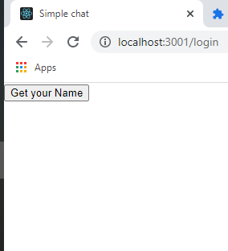
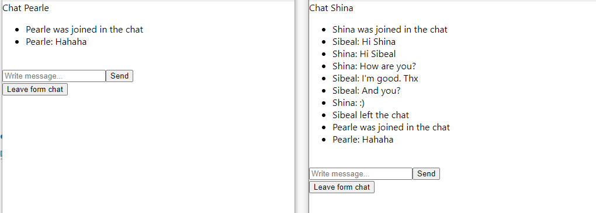

# Simple chat
App includes server and client paths

#Screenshot

##Pre setup
Please check and use the same server address in the both .env files, to guarantee expected work
* For Client: `%Root%\client\.env`
* For Server: `%Root%\.env`

##To turn off CORS error use browser extension
Exp: https://chrome.google.com/webstore/detail/cors-unblock/lfhmikememgdcahcdlaciloancbhjino?hl=ru